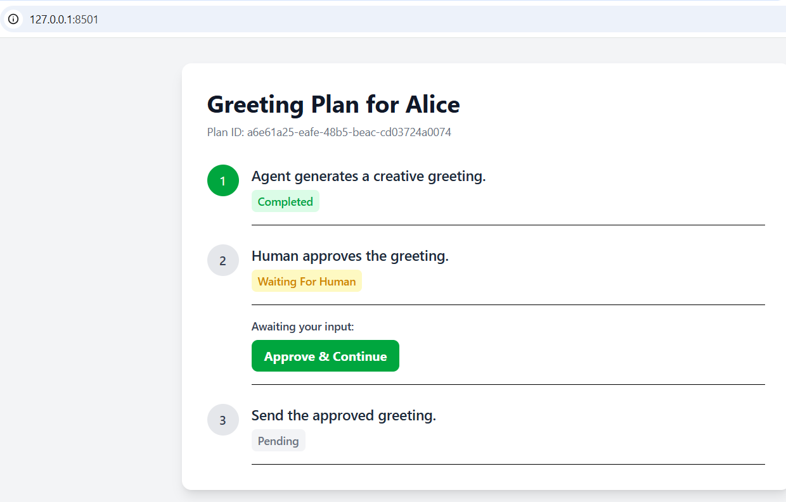
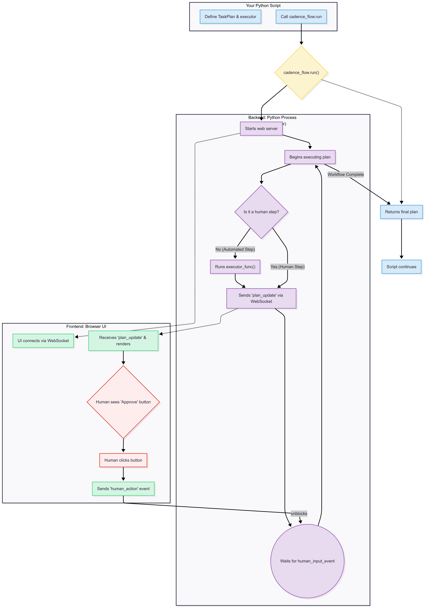

# Cadence Flow

<p align="center">
  <strong>The open-source UI layer for human-in-the-loop AI workflows.</strong>
</p>

<p align="center">
  <a href="https://pypi.org/project/cadence-flow/"></a>
  <a href="https://github.com/cadence-flow/cadence-flow/blob/main/LICENSE"></a>
  <a href="https://discord.gg/YourInviteCodeHere"></a>
</p>

---

`cadence-flow` is a Python library that translates an AI agent's plan into an interactive web UI for human oversight and action. Instead of printing "Waiting for approval..." to a terminal, you can now spin up a rich, interactive session for any human-in-the-loop task with a single line of code: `cadence_flow.run()`.

It's designed for developers building complex AI agents, chains, or RAG systems that require critical human checkpoints for tasks like:
*   Approving a high-stakes action (e.g., sending an email, running code).
*   Validating data or model outputs.
*   Selecting from multiple choices generated by an LLM.

## ✨ The "Wow Moment"

Define a plan in Python, and let Cadence Flow orchestrate it in an interactive UI.

****

## ⚙️ How It Works

At its core, `cadence_flow` starts a local web server and orchestrates communication between your Python script and the browser UI via WebSockets. The `run()` function blocks execution until the workflow is complete, managing the entire lifecycle.

****

## 🚀 Getting Started

### 1. Installation

`cadence-flow` requires Python 3.9+.

```bash
pip install cadence-flow
```

### 2. Your First Workflow

Create a file named `my_first_flow.py` and paste the following code.

```python
import time
import uuid
import cadence_flow
from cadence_flow.models import TaskPlan, Step

# 1. Define the plan
def create_greeting_plan(name: str) -> TaskPlan:
    return TaskPlan(
        plan_id=str(uuid.uuid4()),
        title=f"Greeting Plan for {name}",
        steps=[
            Step(id="s1_generate", description="Agent generates a creative greeting."),
            Step(id="s2_approve", description="Human approves the greeting.", ui_component="human_approval"),
            Step(id="s3_send", description="Send the approved greeting."),
        ]
    )

# 2. Define the executor for automated steps
def execute_step(step: Step, plan: TaskPlan) -> Step:
    print(f"EXECUTOR: Running step '{step.description}'...")
    if step.id == "s1_generate":
        time.sleep(2) # Simulate work
        step.result = {"greeting": f"Hello, World! Welcome, {plan.title.split(' for ')[-1]}."}
        step.status = "completed"
    elif step.id == "s3_send":
        # Check if the human approved the previous step
        approval_step = next((s for s in plan.steps if s.id == "s2_approve"), None)
        if approval_step and approval_step.result.get("approved"):
            print("EXECUTOR: Greeting was approved. Sending now!")
            step.status = "completed"
        else:
            print("EXECUTOR: Greeting was rejected. Aborting.")
            step.status = "failed"
    return step

if __name__ == "__main__":
    my_plan = create_greeting_plan("Alice")
    
    # 3. Run it!
    final_plan = cadence_flow.run(plan=my_plan, executor_func=execute_step)
    
    print("\n--- Workflow Finished ---")
    print(final_plan.model_dump_json(indent=2))
```

### 3. Run the flow

Execute the script from your terminal: `python my_first_flow.py`

A web browser will automatically open with your interactive workflow UI!

## 🗺️ Roadmap

`cadence-flow` is in its early stages. Our vision is to build a comprehensive ecosystem for human-in-the-loop AI.


## 🤝 Contributing

Contributions are welcome! This is a new project, and we would love your help to shape its future. Please feel free to open an issue to discuss a new feature or submit a pull request.

## 📄 License

This project is licensed under the MIT License. See the [LICENSE](LICENSE) file for details.