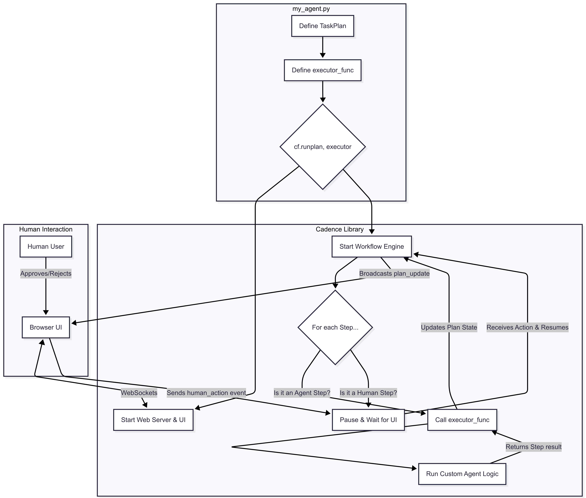
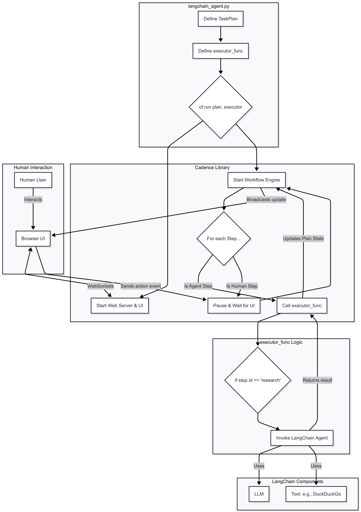
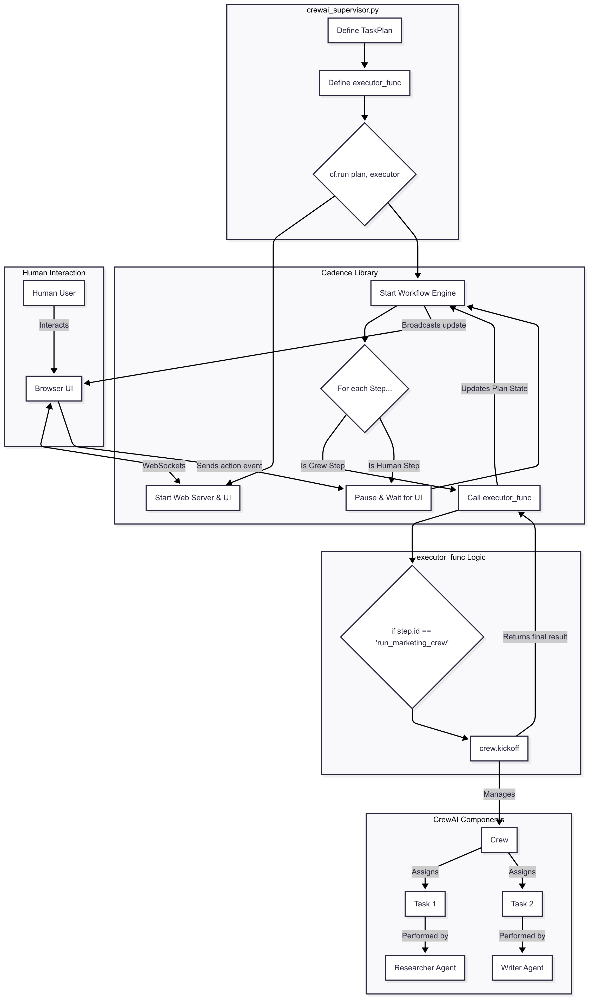

# Cadence Integration Patterns

`cadence-flow` is designed to be a lightweight, flexible supervisory layer that can be integrated with any Python-based AI agent or workflow. The core integration pattern is always the same: your **`executor_func` acts as the bridge** between the Cadence workflow and your agent framework's logic.

This page illustrates how Cadence can wrap around custom agents and popular frameworks like LangChain and CrewAI.

---

### 1. Generic / Custom Agent Integration

This is the baseline pattern, perfect for users who have built their own agent logic.

**How It Works:**
1. The user defines a `TaskPlan` and an `executor_func` containing their custom agent's business logic.
2. `cf.run` starts the Cadence engine.
3. For standard steps, the engine calls the `executor_func`, which runs the user's code.
4. For UI steps (like `human_approval`), the engine pauses and waits for an event from the web UI, which the human interacts with.
5. The engine continuously broadcasts state updates to the UI.

---

### 2. LangChain Integration

Here, the `executor_func` becomes a wrapper around calls to a LangChain agent or chain. This allows you to add human approval gates *between* calls to different LangChain tools or agents.

**How It Works:**
- A Cadence `TaskPlan` can define high-level steps like "Research topic" and "Write summary."
- Inside the `executor_func`, a specific step `id` triggers a call to a pre-configured LangChain agent (e.g., `agent_executor.invoke(...)`).
- This allows a human to, for example, **approve the research results** from one LangChain agent before feeding them into another.

---

### 3. CrewAI Integration

With CrewAI, Cadence can act as a meta-orchestrator, kicking off an entire `Crew`, waiting for its result, and then pausing for human approval before proceeding.

**How It Works:**
- A Cadence `Step` can represent a major business process, like "Run the entire marketing content generation crew."
- The `executor_func` calls `my_crew.kickoff()`, which runs the whole multi-agent collaboration.
- Once the crew has finished, Cadence can present its final output to a human for a final "Publish/Reject" decision in the next step.